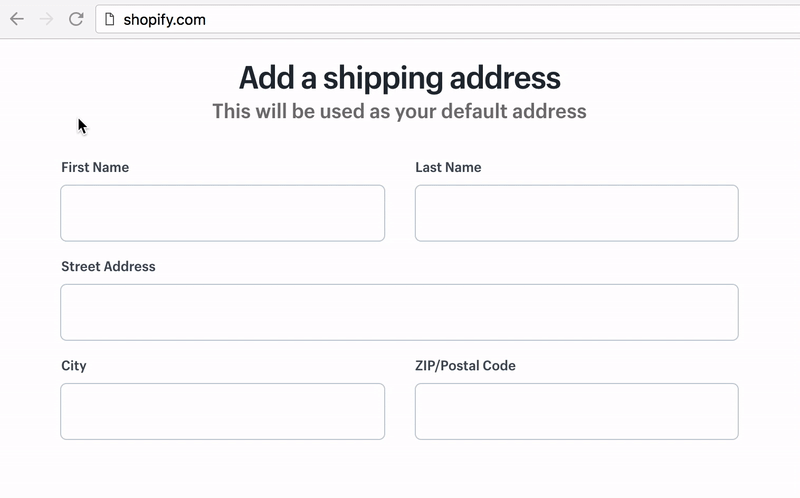
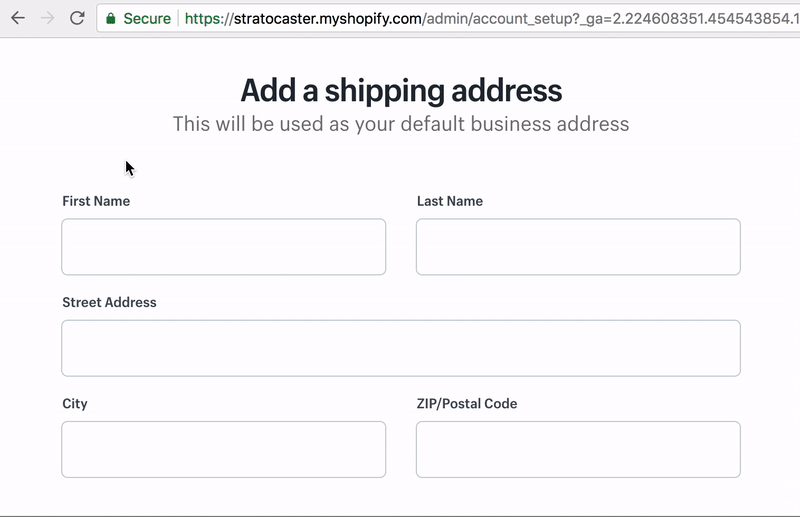

  

Snippets is a Chrome extension allowing you to import JavaScript code snippets from GitHub (including GitHub Enterprise) and execute them via the context menu or omnibox.

## Context Menu
The context menu provides easy access and discovery of snippets by right clicking anywhere on the page. Clicking on a snippet will execute it in the current tab.

  

## Omnibox
The omnibox allows you to fuzzy search all available snippets.

To activate the Snippets omnibox, focus on the address bar and type '`s`' then `tab` or `space`. Once activated you can begin to fuzzy search.

> :bulb: You can use `⌘+l` to jump straight to the address bar.

  

## Recommended snippets

https://github.com/bgrins/devtools-snippets/tree/master/snippets

## FAQ

### What are snippets?
Snippets are small scripts which can be executed within the context of any webpage. A Snippet could do just about anything you can think of, for example it could [pretty print the search query](https://github.com/bgrins/devtools-snippets/tree/3bc7d150e1d0bd7ff27be4df15e949bee94456ff/snippets/querystringvalues) or maybe autofill a large form.

### Why not use the [snippets built-in to Chrome DevTools](https://developers.google.com/web/tools/chrome-devtools/snippets)?
DevTools doesn't provide a way to easily share snippets with your team and requires you to author and maintain snippets in DevTools itself. However, as this extension imports snippets from GitHub, you can easily share them and author them using your preferred editor.

## License

MIT
